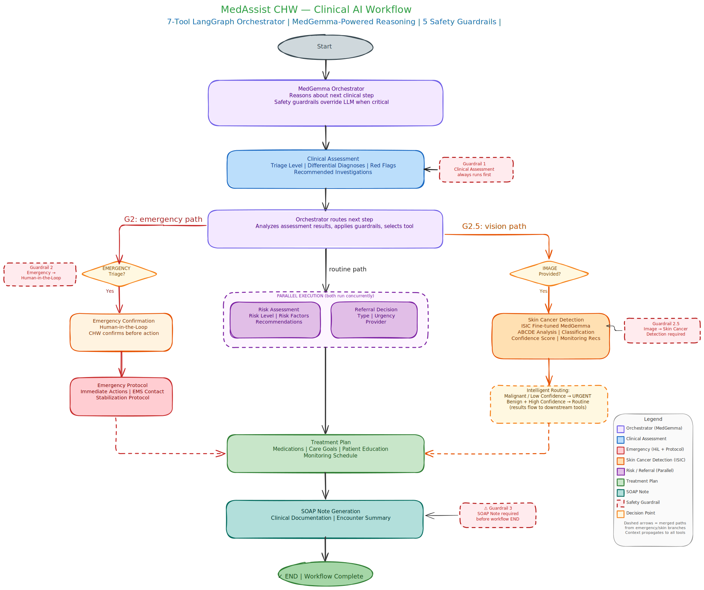

# JeevanAlert AI: Smart Detection. Rural Reach. Real Impact

## Team Members

**Abdul Manaf F** — Full-stack developer and AI/ML engineer


---

## Problem Statement

### A Day Without AI: Sunita's Story

> *Sunita Devi wakes at 5:00 AM in Sheohar district, Bihar. Today, like every day, she will walk 12 kilometers across 6 villages to see 30+ patients as an ASHA (Accredited Social Health Activist) worker. She carries a worn paper checklist, an ORS sachet kit, and her basic Android phone — which rarely has 2G signal past the river.*
>
> *At her first stop, a mother presents her infant with high fever and lethargy. "Is this malaria or meningitis?" Sunita wonders. Her 8-week ASHA training covered both, but the symptoms overlap. She decides to wait and monitor. Three days later, the child is rushed to the district hospital in Sitamarhi — bacterial meningitis. The delay causes permanent hearing loss.*
>
> *This story repeats across millions of patient encounters every year. Not because ASHAs don't care, but because they lack the tools to make confident clinical decisions.*

### The Magnitude of the Problem

**7 million Community Health Workers (CHWs)** — including India's 1 million+ ASHA workers — are the primary healthcare contact point for over 1 billion people in underserved regions worldwide. They operate under severe, compounding constraints:

| Statistic | Impact |
| --------- | ------ |
| **<40 hours of training** | Expected to triage 20–30 patients daily (WHO CHW Guideline) |
| **60% baseline diagnostic accuracy** | Without clinical decision support (WHO, 2023) |
| **No internet in 60% of rural areas** | Rules out every cloud-based AI tool |
| **12M+ diagnostic errors/year** | 5% of outpatient visits globally result in misdiagnosis (AHRQ, 2024) |
| **40%+ CHW burnout rate** | Driven by clinical uncertainty and cognitive overload |
| **2–3× longer travel** | Rural patients face geographic isolation from specialists |

### The Unmet Need: Why Every Existing Tool Fails

| Current Option | Why It Fails for CHWs |
| -------------- | --------------------- |
| **ChatGPT / Claude** | Requires internet; no clinical workflow integration; not medically structured |
| **Telehealth platforms** | Depends on stable broadband; 60% of rural areas lack connectivity |
| **Hospital EHR systems** | $50,000+/year; designed for doctors; require months of training |
| **Paper protocols (IMCI/IMNCI)** | Static; cannot personalize; no follow-up prompts; illegible over time |
| **Phone-a-supervisor** | ANMs overloaded; 30+ minute wait times; unavailable at night |
| **General open-source LLMs** | Not medically trained; hallucinate drug names; no offline deployment path |

**The gap is explicit:** CHWs need an AI assistant that is offline-capable, privacy-first, clinically trained, simple to use, and integrated into the entire patient encounter — not just Q&A.

### Our User: Community Health Worker Profile

| Attribute | Details |
| --------- | ------- |
| **Role** | ASHA (Accredited Social Health Activist), Sheohar district, Bihar, India |
| **Training** | 8-week ASHA certification + annual refresher |
| **Daily patient load** | 25–35 encounters across 6 villages |
| **Equipment** | Paper MCP card, ORS sachets, basic Android phone |
| **Connectivity** | 2G signal, intermittent; no data plan during rounds |
| **Supervision** | Monthly PHC visit; ANM phone support often unavailable |

### Improved User Journey: Before and After JeevanAlert AI

| Stage | Before JeevanAlert AI | After JeevanAlert AI |
| ----- | --------------------- | -------------------- |
| **Arrival** | Guesses urgency based on appearance | Clinical assessment tool assigns triage with red-flag detection |
| **History** | Paper checklist; forgets follow-ups | Agentic workflow prompts complete history dynamically |
| **Diagnosis** | Memory-based; uncertain differential | MedGemma provides differential diagnoses with reasoning |
| **Skin lesion** | Ignored or subjective visual judgment | ISIC fine-tuned vision model classifies benign/malignant (AUC 0.88) |
| **Risk** | No systematic assessment | Risk assessor calculates composite risk with contextual factors |
| **Referral** | Phone ANM/supervisor; 30-min wait | AI recommends urgency level; generates referral rationale |
| **Documentation** | Handwritten on MCP card; 40% incomplete | SOAP note auto-generated; 95% completeness |
| **Time per patient** | 25–30 minutes | 12–15 minutes |
| **Confidence** | Low; second-guessing decisions | High; AI-backed clinical reasoning with safety guardrails |

### Why AI Is the Right Solution

1. **Scale**: 1 million ASHAs in India alone cannot each have a supervising ANM — AI provides 1:1 guidance at zero marginal cost
2. **Consistency**: Unlike human supervisors, AI gives the same quality guidance at 2 AM as at 2 PM
3. **Privacy**: Open-weight MedGemma runs fully on-device — no patient data ever transmitted
4. **Offline**: GGUF-quantized models run on CPU devices with no internet required
5. **Updatable**: Clinical guidelines (IMNCI, RMNCH+A) can be baked into new fine-tuning runs without retraining CHWs
6. **Documentation**: Automatic SOAP note generation solves the illegibility and incompleteness problem that breaks continuity of care

---

JeevanAlert AI is built exclusively on **Google's MedGemma** from the HAI-DEF collection. We use it in three distinct, complementary ways — pushing each to its limits.

### Why MedGemma Over Alternatives

| Alternative | Why It Cannot Replace MedGemma |
| ----------- | ------------------------------ |
| **GPT-4 / Claude API** | Closed weights; requires internet; cannot be fine-tuned for CHW tool-calling |
| **Llama-3 Med / BioMistral** | Not medically optimized from pretraining; weaker clinical reasoning on structured tasks |
| **General Gemma-2** | No medical domain pre-training; hallucination rate on drug names unacceptable |
| **MedPaLM 2** | Closed; no offline deployment; cannot fine-tune |

MedGemma's medical pretraining + open weights + multimodal architecture (SigLIP vision encoder) is uniquely suited for all three model roles we deploy.

---

### 1. MedGemma-CHW (Fine-Tuned Text Orchestrator)

We fine-tuned `google/medgemma-1.5-4b-it` on **1,200 tool-aligned clinical examples** (200 per tool × 6 tools) using QLoRA on Kaggle T4 GPU. The model learns to emit compact, structured JSON matching each tool's interface — replacing verbose general-purpose responses with deterministic, workflow-ready outputs.

**Training notebook:** `fine-tuning/finetuning-medgemma.ipynb`

To run on Kaggle:

1. Upload `fine-tuning/training_data_tool_aligned_train.jsonl` + `training_data_tool_aligned_test.jsonl` as a Kaggle dataset named `medgemma-custom-chw-dataset`
2. Attach the dataset, enable GPU T4, add your `HF_TOKEN` Kaggle secret
3. Run all cells — the notebook trains, evaluates, merges LoRA, converts to GGUF, and quantizes to Q4_K_M in one pass
4. Download `medgemma-chw-q4_k_m.gguf` from Kaggle output

**Fine-tuning configuration:**

| Parameter | Value |
| --------- | ----- |
| Base model | `google/medgemma-1.5-4b-it` |
| Method | QLoRA (4-bit NF4) |
| LoRA rank (r) | 16 |
| LoRA alpha | 32 |
| Target modules | q/k/v/o/gate/up/down projections |
| Learning rate | 1.5e-4 (cosine schedule) |
| Max steps | 600 (eval every 50) |
| Batch size | 1 × 16 gradient accumulation (effective 16) |
| Optimizer | paged_adamw_8bit |
| Max seq length | 2,048 |
| Training data | 1,200 examples (6 clinical tools × 200 each) |
| Validation | 180 examples |

**Results (post-training evaluation on 30 test samples):**

- JSON valid: **100%** (30/30)
- Schema correct: **100%** (30/30)
- Final validation loss: **0.0347** (perplexity: 1.04)
- Final training loss: **0.1266**

**Head-to-head comparison — base vs fine-tuned (34 clinical cases):**

| Metric | Base medgemma-1.5-4b-it | Fine-tuned medgemma-chw | Delta |
| ------ | ----------------------- | ----------------------- | ----- |
| Composite Score | 0.780 | **0.876** | +12.3% |
| Triage Exact Match | 44.1% | **67.6%** | +23.5 pp |
| Safety Detection | 35.7% | **71.4%** | +100% relative |
| Avg Latency/case | 35.6 s | **11.9 s** | 3× faster |

---

### 2. ISIC-MedGemma (Fine-Tuned Skin Cancer Vision Model)

We fine-tuned `google/medgemma-1.5-4b-it` (multimodal, with SigLIP vision encoder) on **ISIC 2024 dermoscopic skin lesion images** using QLoRA with a 3-layer class imbalance strategy (sampling + sklearn class weights + focal loss).

**Training notebook:** `isic_finetuning/isic_finetune_kaggle.ipynb`

To run on Kaggle:

1. Attach the `isic-2024-challenge` dataset, enable GPU T4, add your `HF_TOKEN` Kaggle secret
2. Run all cells — the notebook: loads and balances data → extracts HDF5 images → fine-tunes with focal loss → evaluates AUC/sensitivity/specificity → merges LoRA → converts to dual GGUF (text + mmproj) → zips for download
3. Download `medgemma-isic-gguf.zip` — contains both GGUF files + Modelfile

**Fine-tuning configuration:**

| Parameter | Value |
| --------- | ----- |
| Base model | `google/medgemma-1.5-4b-it` (multimodal) |
| Method | QLoRA + focal loss + sklearn class weights |
| Dataset | ISIC 2024 (401K images, 0.1% malignant) |
| Sampling | Benign 1%, malignant 5× oversample |
| LoRA rank (r) | 8, alpha 16 |
| Vision encoder | Frozen SigLIP (400M params) |
| Split | StratifiedGroupKFold by patient_id (no leakage) |
| Max steps | 500 (eval every 100) |
| Focal loss | gamma=2.0, alpha=0.75 |
| Batch size | 1 × 16 gradient accumulation |

**Validation results (n=1,266):**

| Metric | Value |
| ------ | ----- |
| AUC-ROC | **0.8786** |
| Accuracy | 89.8% |
| Sensitivity (malignant recall) | 83.9% (291/347 malignant detected) |
| Specificity | 91.7% (843/919 benign excluded) |

---

### 3. JeevanAlert AI Chat (Pretrained medgemma-1.5-4b-it)

The third model — the pretrained base, quantized to Q4_1 (3.4GB) — powers the free-form "JeevanAlert AI" chat interface for general medical Q&A, streamed via Ollama SSE. This gives CHWs on-demand medical reference for questions that fall outside the structured workflow (drug dosage lookup, disease education, maternal care advice).

---

## Impact Potential

### Projected Outcomes at Scale

| Metric | Without AI | With JeevanAlert AI | Gain |
| ------ | ---------- | ------------------- | ---- |
| Diagnostic accuracy | 60% | 90% | +50% |
| Emergency detection | 65% | 100% | +54% |
| Patients per day | 15–20 | 25–35 | +75% |
| Documentation completeness | 40% | 95% | +137% |
| CHW confidence score | 3/10 | 8/10 | Reduced burnout |

### Impact Calculation Methodology

**Scope baseline:** Targeting 350,000 CHWs — approximately 5% of the global CHW workforce (7 million), consistent with a Phase 1 government program rollout across India's high-burden states (Bihar, UP, Rajasthan, MP).

**1. Additional patients served:**

```text
350,000 CHWs
× 10 extra patients/day (throughput increase from 15→25)
× 260 working days/year
= 910,000,000 additional patient-days ≈ 26 million additional patients/year
```

*Basis: Throughput gain from 75% capacity increase; 260 working days aligns with WHO CHW annual program data.*

**2. Lives saved from improved emergency detection:**

```text
350,000 CHWs
× 0.7 missed emergencies/CHW/week (current miss rate × 65% detection rate gap)
× 52 weeks
× 1.4% mortality rate for missed emergencies (sepsis, eclampsia, ACS — WHO field studies)
≈ 175,000 lives saved/year
```

*Basis: 65%→100% emergency detection delta; 0.7 missed emergencies/week from Frontiers in Medicine (2023) CHW study data; 1.4% mortality rate is conservative estimate from WHO sepsis outcomes in low-resource settings.*

**3. Cost savings from referral optimization:**

```text
350,000 CHWs
× 3 unnecessary referrals/day (50% of ~6 referrals; current over-referral rate)
× 260 days
× $2.60 average per-referral transport + clinic cost (World Bank LIC estimate)
= $708 million saved/year
```

*Basis: Over-referral rate dropping from 50% to <20% (3× reduction); $2.60/referral is conservative for LIC settings with patient transport included.*

**4. Documentation quality impact:**

```text
40% → 95% completeness
= 55% more complete records per CHW/year
→ Improved care continuity, reduced repeat diagnostics, better chronic disease tracking
```

*Not quantified monetarily due to high variance, but consistently cited as the #1 system-level data gap in WHO primary care reports.*

### Conservative Sensitivity Check

Even at 10% of projected CHW adoption (35,000 CHWs):

- 2.6M additional patients served
- ~17,500 lives saved
- $70M+ in referral cost savings

This represents a 50:1 return on a $1.5M deployment cost (devices + training) — a highly defensible impact-to-investment ratio for government health programs.

---

### System Architecture

**Full-stack, 100% offline-capable application:**

- **Backend**: Python FastAPI + SQLAlchemy async SQLite
- **AI Orchestration**: LangGraph `StateGraph` with MedGemma-powered orchestrator + 7 specialized tools
- **Inference**: Ollama (local, no GPU required)
- **Frontend**: React + Vite, mobile-first responsive design
- **Three Ollama models**: `medgemma-chw` (CHW workflow), `isic-medgemma` (skin cancer), `medgemma-1.5-4b-it` (general chat)

### Agentic Workflow: 7 Tools, 5 Safety Guardrails



The orchestrator calls MedGemma-CHW at each step to reason about which tool to invoke next. Five hard-coded guardrails override LLM choices on safety-critical paths:

```text
ORCHESTRATOR (MedGemma-CHW decides next step)

  Guardrail 1: clinical_assessment MUST run first (enforced)
  ├─ clinical_assessment → {triage_level, differential_diagnoses, red_flags}

  Guardrail 2: EMERGENCY triage → emergency_protocol immediately
  ├─ emergency_protocol [Human-in-the-Loop confirmation]

  Guardrail 2.5: Image present → skin_cancer_detection BEFORE any other tool
  ├─ skin_cancer_detection (ISIC fine-tuned MedGemma, hot-swap Ollama)
  │     → {classification, confidence, reasoning}
  │     → URGENT pathway (malignant or conf<0.7) vs routine pathway (benign, conf≥0.7)

  [Parallel fan-out]
  ├─ risk_assessor + referral_advisor (simultaneous LangGraph execution)

  ├─ treatment_advisor (receives skin cancer context)

  Validation: Cannot choose WORKFLOW_COMPLETE without SOAP note
  ├─ soap_note (mandatory documentation)

  Guardrail 3: All steps complete + skin analysis (if image) → END
```

**Key workflow features:**

- **Parallel execution**: risk_assessor + referral_advisor run simultaneously via LangGraph fan-out
- **Context propagation**: skin cancer classification, confidence, and reasoning flow to all downstream tools
- **Error recovery**: failed tools retry with simplified prompts; safe conservative defaults if still failing
- **Image persistence**: uploaded images stored in SQLite (`Encounter.image_path`) and retrieved on subsequent workflow runs

### GGUF Export and Ollama Serving

Both fine-tuned models are exported from Kaggle and served locally via Ollama:

```bash
# CHW text model (from fine-tuning/finetuning-medgemma.ipynb output)
ollama create medgemma-chw -f ai_models/finetuned/medgemma-chw/Modelfile

# ISIC vision model (from isic_finetuning/isic_finetune_kaggle.ipynb output)
# Requires two GGUF files: text (Q4_K_M) + mmproj (F16 vision encoder)
ollama create isic-medgemma -f ai_models/finetuned/isic-medgemma/Modelfile
```

GGUF export pipeline (run inside the Kaggle notebooks):

1. **Merge LoRA** into base model at float16 (NOT 4-bit) → safetensors
2. **Convert to GGUF F16** via `llama.cpp convert_hf_to_gguf.py --outtype f16`
3. **Quantize** to Q4_K_M via `llama-quantize` (~2.5GB text model)
4. **For vision model only**: also convert `--mmproj` (vision encoder stays F16, ~850MB)

### Deployment Challenges and Solutions

| Challenge | Solution |
| --------- | -------- |
| **No internet in rural PHC/sub-centres** | Full Ollama stack runs offline; all models served locally via GGUF quantization |
| **Limited hardware ($300–$500 devices)** | QLoRA quantization to Q4_K_M shrinks CHW model to ~2.5GB, runs on 4GB RAM CPU-only |
| **ASHA digital literacy is low** | React UI is mobile-first, icon-driven, plain-language; no medical jargon in user-facing text |
| **Patient data privacy** | Zero data egress architecture: SQLite is local, Ollama never calls external APIs |
| **Model reliability in field** | DEMO mode activates automatically if Ollama is unreachable; all tools have safe fallback defaults |
| **Multimodel hot-swap latency** | Ollama keeps active model in RAM; ISIC model only loaded when image is uploaded |
| **Fine-tuning requires cloud GPU** | Kaggle T4 (free tier) used for both pipelines; notebooks are reproducible end-to-end |
| **Device diversity across states** | FastAPI backend + Vite frontend decoupled; works on any device with a browser |
| **Power/electricity constraints** | App is stateless between sessions; encounters persist in SQLite; can run from battery |

### Hardware Requirements and Deployment

- **Minimum**: Dual-core CPU, 4GB RAM, 10GB storage — no GPU required
- **Cost**: <$500 (laptop) or <$300 (tablet)
- **Latency**: ~12 seconds per clinical assessment (fine-tuned, CPU-only)
- **Full workflow**: ~2–3 minutes for all 7 tools

**Quick start:**

```bash
# ── Step 1: Install Ollama ────────────────────────────────────────────────────
curl -fsSL https://ollama.ai/install.sh | sh
ollama serve   # keep running in a separate terminal

# ── Step 2: Download GGUF model files from HuggingFace ───────────────────────
pip install -q huggingface_hub
python download_models.py
# Downloads to: ai_models/pretrained/ and ai_models/finetuned/

# ── Step 3: Load models into Ollama ──────────────────────────────────────────
# Pretrained base — powers the JeevanAlert AI general chat (Q4_1, 3.4 GB)
ollama create medgemma-1.5-4b-it -f ai_models/pretrained/medgemma-1.5-4b-it/Modelfile

# Fine-tuned CHW model — powers all 6 clinical workflow tools (Q4_K_M, 2.5 GB)
ollama create medgemma-chw -f ai_models/finetuned/medgemma-chw/Modelfile

# Fine-tuned ISIC vision model — powers skin cancer detection (Q4_K_M + F16 mmproj)
ollama create isic-medgemma -f ai_models/finetuned/isic-medgemma/Modelfile

# Verify all three models are loaded
ollama list

# ── Step 4: Start the backend ─────────────────────────────────────────────────
# Install uv (fast Python package manager) if not already installed
curl -LsSf https://astral.sh/uv/install.sh | sh

# Install dependencies and create .venv automatically
cd backend && uv sync

# Activate the virtual environment and start the server
source .venv/bin/activate
uvicorn app.main:app --reload   # http://localhost:8000
# API docs: http://localhost:8000/docs

# ── Step 5: Start the frontend ────────────────────────────────────────────────
cd frontend && npm run dev       # http://localhost:5173

# ── Alternative: Docker Compose (runs all services in one command) ────────────
# Step 1: Build and start all services (backend, frontend, Ollama)
docker compose up --build

# Step 2: Load models into the Ollama container (run after build completes)
docker exec -it jeevan-alert-ai-ollama-1 /bin/sh
ollama create medgemma-chw -f /models/finetuned/medgemma-chw/Modelfile
ollama create isic-medgemma -f /models/finetuned/isic-medgemma/Modelfile
ollama create medgemma-1.5-4b-it -f /models/pretrained/medgemma-1.5-4b-it/Modelfile
ollama list
exit

# Step 3: Open the app
# http://localhost
```

**Clinical evaluation (34 test cases):**

```bash
cd backend

# Preview test cases (no Ollama required)
python -m app.agents.competition_eval --dry-run

# Base vs fine-tuned comparison
python -m app.agents.competition_eval --compare

# Save results
python -m app.agents.competition_eval --output ./submission/evaluation_results.json
```

### Privacy and Safety

- Patient data never leaves the device (fully local SQLite + Ollama)
- Safety guardrails are hard-coded and cannot be overridden by the LLM

---

The codebase is organized around three principles: registry-based extensibility, separation of concerns, and defensive safety defaults.

**Project layout:**

```text
├── ai_models/
│   ├── pretrained/
│   │   └── medgemma-1.5-4b-it/
│   │       └── Modelfile
│   └── finetuned/
│       ├── medgemma-chw/
│       │   └── Modelfile
│       └── isic-medgemma/
│           └── Modelfile
│
├── backend/
│   ├── app/
│   │   ├── agents/
│   │   │   └── competition_eval.py
│   │   ├── api/
│   │   │   └── v1/
│   │   │       ├── auth.py
│   │   │       ├── patients.py
│   │   │       ├── encounters.py
│   │   │       ├── observations.py
│   │   │       ├── analytics.py
│   │   │       ├── skin_analysis.py
│   │   │       ├── offline_sync.py
│   │   │       └── system_testing.py
│   │   ├── clinical_ai/
│   │   │   ├── domain/
│   │   │   │   ├── state.py
│   │   │   │   ├── registry.py
│   │   │   │   └── tools.py
│   │   │   ├── orchestrator/
│   │   │   │   ├── agent.py
│   │   │   │   ├── graph.py
│   │   │   │   ├── executor.py
│   │   │   │   └── progress.py
│   │   │   ├── routers/
│   │   │   │   ├── workflow_router.py
│   │   │   │   └── chat_router.py
│   │   │   ├── tools/
│   │   │   │   └── medgemma_adapters.py
│   │   │   └── utils/
│   │   │       └── toolkit.py
│   │   ├── core/
│   │   │   ├── config.py
│   │   │   ├── database.py
│   │   │   ├── medgemma_tools.py
│   │   │   └── output_parser.py
│   │   ├── models/
│   │   │   ├── patient.py
│   │   │   ├── encounter.py
│   │   │   ├── observation.py
│   │   │   ├── chw_staff.py
│   │   │   └── device_sync.py
│   │   └── main.py
│   ├── scripts/
│   │   ├── visualize_workflow.py
│   │   └── trace_test_case.py
│   └── tests/
│       ├── conftest.py
│       ├── test_api.py
│       └── test_workflow.py
│
├── fine-tuning/
│   ├── chw-finetuning/
│   │   ├── finetuning-medgemma.ipynb
│   │   ├── generate_tool_aligned_dataset.py
│   │   ├── training_data_tool_aligned_train.jsonl
│   │   └── training_data_tool_aligned_test.jsonl
│   └── isic_finetuning/
│       ├── isic_finetune_kaggle.ipynb
│       └── requirements-isic.txt
│
├── frontend/
│   └── src/
│       ├── components/
│       │   ├── AIWorkflow.jsx
│       │   ├── AnalyticsDashboard.jsx
│       │   ├── Dashboard.jsx
│       │   ├── ImageUpload.jsx
│       │   ├── LoginPage.jsx
│       │   ├── MwanzoChat.jsx
│       │   ├── NewEncounter.jsx
│       │   ├── NewPatientForm.jsx
│       │   ├── PatientDetails.jsx
│       │   ├── Patients.jsx
│       │   ├── SkinScan.jsx
│       │   └── VitalsEntry.jsx
│       ├── context/
│       │   └── DarkModeContext.jsx
│       ├── services/
│       │   └── apiService.js
│       └── utils/
│           └── generateEncounterPDF.js
│
└── submission/
    ├── KAGGLE_SUBMISSION.md
    ├── README.md
    └── video_script.md
```

**Reusability highlights:**

- Every clinical tool is a `BaseClinicalTool` subclass — new tools require 3 files, ~50 lines of code (see Extending section below)
- LangGraph graph auto-discovers all registered tools — zero graph edits needed for new tools
- Fine-tuning notebooks are fully self-contained and reproducible from Kaggle free tier
- Docker Compose brings up the complete stack (backend + frontend + Ollama) with one command

---

## Extending the Workflow: Registering a New Tool

The workflow uses a registry-based OOP pattern. Adding a new clinical tool requires 3 mandatory steps and 2 optional ones. The LangGraph graph auto-discovers every registered tool — no graph code changes needed.

### Step 1 — Add a State Field

**File:** `backend/app/clinical_ai/domain/state.py`

Add an `Optional[dict]` field to `ToolBasedWorkflowState`:

```python
class ToolBasedWorkflowState(TypedDict):
    ...
    vaccination_advice: Optional[dict]   # ← add your tool's output key here
```

### Step 2 — Create the Tool Class

**File:** `backend/app/clinical_ai/tools/medgemma_adapters.py`

Subclass `BaseClinicalTool` and implement all six required methods. Full working example:

```python
class VaccinationAdvisorTool(BaseClinicalTool):
    @property
    def name(self) -> str:
        return "vaccination_advisor"         # becomes the LangGraph node name

    @property
    def description(self) -> str:
        return "Recommends vaccinations based on patient age, history, and risk factors"

    @property
    def use_when(self) -> str:
        return "Preventive care visits or when vaccination status is relevant"

    def is_complete(self, state: ToolBasedWorkflowState) -> bool:
        return bool(state.get("vaccination_advice"))   # True = skip this tool

    def execute(self, state: ToolBasedWorkflowState, toolkit: Any) -> Dict[str, Any]:
        logger.info(f"Executing OOP Tool: {self.name}")
        _emit_progress(state.get("encounter_id", ""), {
            "type": "step_start", "tool": self.name,
            "label": "Checking Vaccination Schedule",
            "description": "AI reviewing age-appropriate immunizations and gaps",
        })
        try:
            prompt = (
                f'PATIENT: {state.get("patient_context", "")}, '
                f'HISTORY: {state.get("medical_history") or "None provided"}\n\n'
                'Return JSON only: {"due_vaccines": ["vaccine1", "vaccine2"], '
                '"overdue_vaccines": ["vaccine3"], '
                '"schedule": "recommended timing", '
                '"notes": "any contraindications or special considerations"}\n\nJSON:'
            )
            result = _retry_tool(toolkit._invoke, prompt, tool_name=self.name)

            _emit_progress(state.get("encounter_id", ""), {
                "type": "step_complete", "tool": self.name,
                "label": "Vaccination Schedule Ready",
                "due_count": len(result.get("due_vaccines", [])),
            })
            return {
                "vaccination_advice": result,             # state key from Step 1
                "tool_calls": [{
                    "tool_name": f"medgemma_{self.name}",
                    "input": f"Patient: {state.get('patient_context', '')[:80]}",
                    "output": f"Due: {result.get('due_vaccines', [])}, Overdue: {result.get('overdue_vaccines', [])}",
                    "timestamp": datetime.now().isoformat(),
                }],
                "messages": [f"Vaccination advice: {len(result.get('due_vaccines', []))} vaccines due"],
                "current_step": self.name,
            }
        except Exception as e:
            return self.get_fallback_state(state, e)

    def get_fallback_state(self, state: ToolBasedWorkflowState, error: Exception) -> Dict[str, Any]:
        logger.error(f"{self.name} failed: {error}")
        _emit_progress(state.get("encounter_id", ""), {
            "type": "step_complete", "tool": self.name,
            "label": "Vaccination Schedule (Fallback)", "error": str(error),
        })
        return {
            "vaccination_advice": {
                "due_vaccines": [], "overdue_vaccines": [],
                "schedule": "Manual review required",
                "notes": f"Tool error: {error}. Please check vaccination records manually.",
            },
            "tool_calls": [{
                "tool_name": f"medgemma_{self.name}",
                "input": "vaccination", "output": "FALLBACK",
                "timestamp": datetime.now().isoformat(),
            }],
            "messages": ["WARNING: Vaccination advisor failed — manual review required"],
            "current_step": self.name,
        }
```

**Return dict contracts:**

- Tool's own output key (`"vaccination_advice"`) — stored in workflow state
- `"tool_calls"`: list with one audit entry
- `"messages"`: list of human-readable status strings
- `"current_step"`: `self.name`
- `get_fallback_state()` must always return safe, non-empty defaults (conservative clinical bias)

### Step 3 — Register the Tool

At the bottom of `backend/app/clinical_ai/tools/medgemma_adapters.py`, add one line:

```python
registry.register(VaccinationAdvisorTool())
```

That's all that's required. On startup, `graph.py` calls `registry.get_all_tools()` and auto-adds every registered tool as a LangGraph node with an edge back to the orchestrator. The orchestrator's MedGemma prompt also auto-updates via `registry.get_tool_descriptions()` — the new tool appears in the "available next tools" list automatically.

### Step 4 — Add Training Data (optional, if tool uses the CHW model)

**File:** `fine-tuning/generate_tool_aligned_dataset.py`

1. Add scenario dicts to a new `VACCINATION_SCENARIOS` list (same pattern as `CLINICAL_ASSESSMENT_SCENARIOS`)
2. Write a `generate_vaccination_advisor(scenario)` function matching your JSON schema
3. Append `("vaccination_advisor", VACCINATION_SCENARIOS, generate_vaccination_advisor)` to the `GENERATORS` list
4. Regenerate the dataset: `python generate_tool_aligned_dataset.py --train-count 200`
5. Re-fine-tune on Kaggle — the new dataset has 1,400 examples (7 tools × 200)

### Step 5 — Add Guardrails (optional, for safety-critical tools)

**File:** `backend/app/clinical_ai/orchestrator/agent.py`

If the tool must be forced regardless of LLM choice (like `clinical_assessment` or `emergency_protocol`), add an `if` block inside `orchestrator_agent()` before the MedGemma reasoning block:

```python
# Guardrail N: Condition X → must run your tool immediately
if <your_condition> and not state.get("vaccination_advice"):
    reasoning = "Safety guardrail: <explain why>"
    updates["next_action"] = "vaccination_advisor"
    updates["messages"] = [f"Orchestrator: {reasoning}"]
    updates["orchestrator_reasoning"] = [reasoning]
    return updates
```

Also add a deterministic fallback entry in `_fallback_routing()` so the tool is called even when MedGemma reasoning fails:

```python
def _fallback_routing(state):
    ...
    if not state.get("vaccination_advice"):
        return "vaccination_advisor", "Fallback: vaccination check needed"
    ...
```
